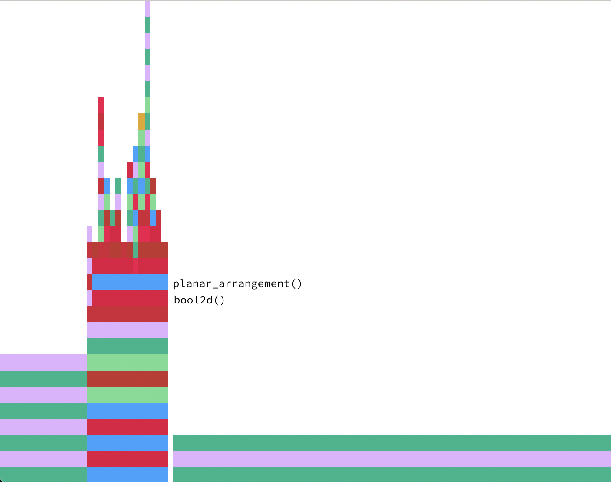
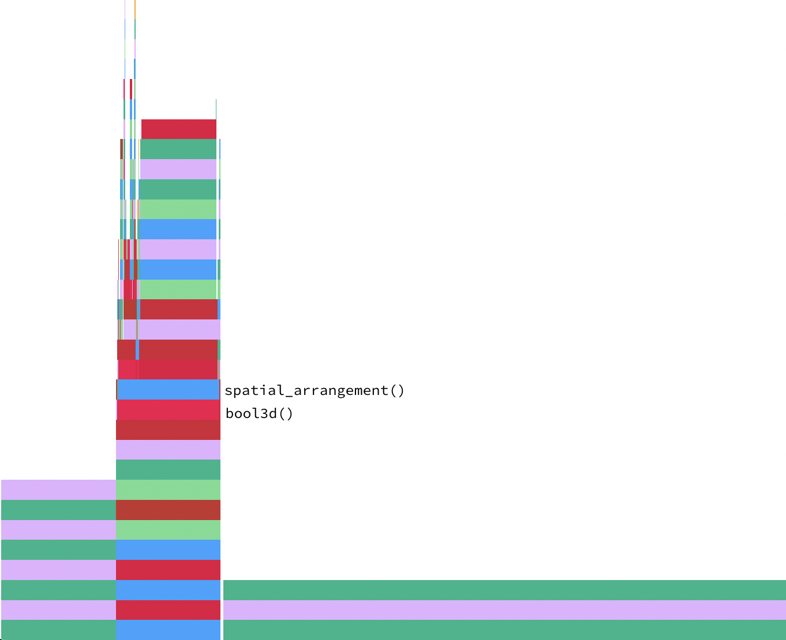

## Prestazioni  

Durante lo studio definitivo del progetto, sono stati eseguiti dei benchamrk, tramite la macro `@btime` del package **BenchmarkTools**, per valutare le prestazioni e osservare i benifici apportati alle varie porzioni di codice. 

Come sperato, le modifiche introdotte hanno migliorato complessivamente le prestazioni rispetto la versione originale, riducendo il tempo di esecuzione di ogni funzione di cui il progetto è composto e il numero di allocazioni in memoria.

E' da notare come le funzioni `bool2d()` e `bool3d()` siano rispettivamente influenzate da `planar_arrangement()`e da `spatial_arrangement()`. I tempi di esecuzione di quest'ultime, infatti, impattono fortemente sulle prestazioni complessive del codice. Le figure di seguito, generate automaticamente dal package **ProfileView**, mostrano graficamente quanto espresso.




## Errori noti

Nell’esempio sottostante (due cubi con spigolo unitario e con una faccia in comune) la funzione `Lar.coboundary_1()` non funziona correttamente e restituisce un errore sul file `interface.jl` presente in un altro progetto.

```julia
import LinearAlgebraicRepresentation as Lar
import ViewerGL as GL
using Base.Threads, SparseArrays
n, m, p = 1, 1, 1
V, (VV, EV, FV, CV) = Lar.cuboidGrid([n, m, p], true)
cube = V, FV, EV
assembly = Lar.Struct([
    Lar.Struct([Lar.t(0, 0, 0), Lar.r(0, 0, 0), cube])
    Lar.Struct([Lar.t(0, 0, 1), Lar.r(0, 0, 0), cube])
])
V, FV = Lar.struct2lar(assembly)

meshes = []
for k = 1:length(FV)
    color = GL.MayaColors[k%12+1] - (rand(Float64, 4) * 0.1)
    push!(meshes, GL.GLGrid(V, [FV[k]], color, 0.9))
end

GL.VIEW(meshes);
W, (copEV, copFE, copCF), boolmatrix = LARgenerators.bool3d(assembly)
```
