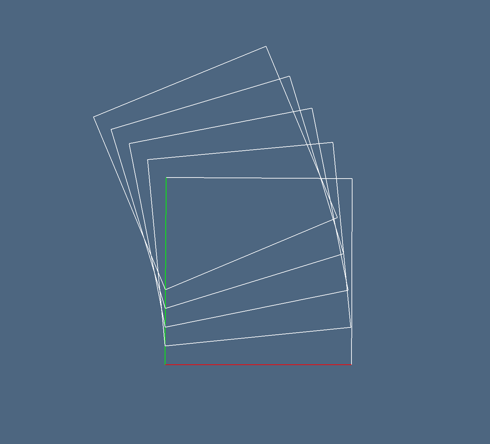
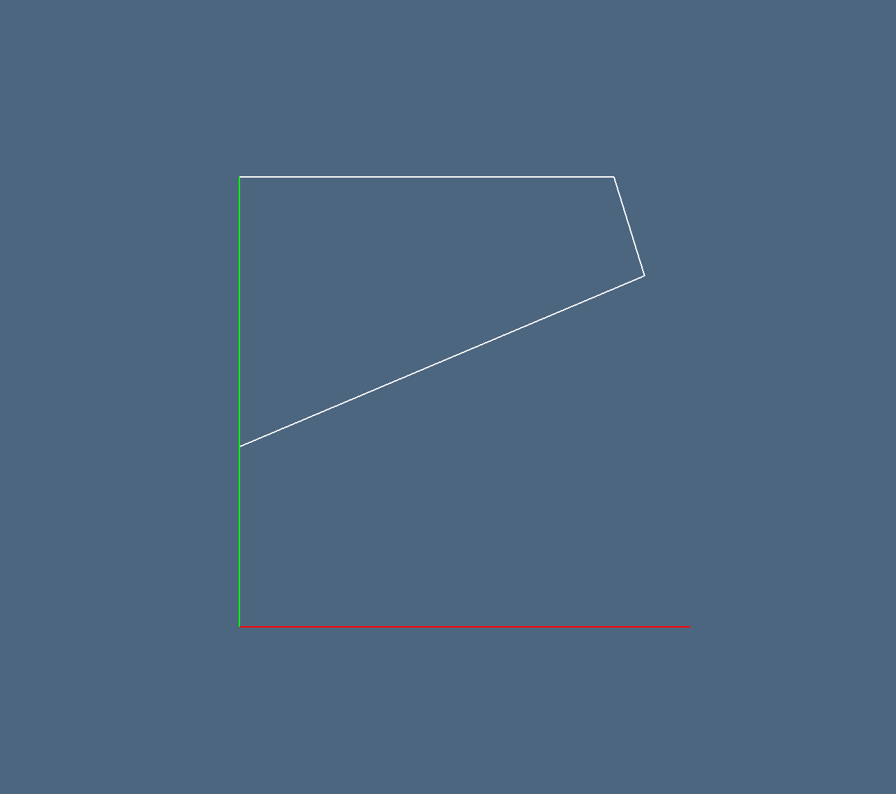
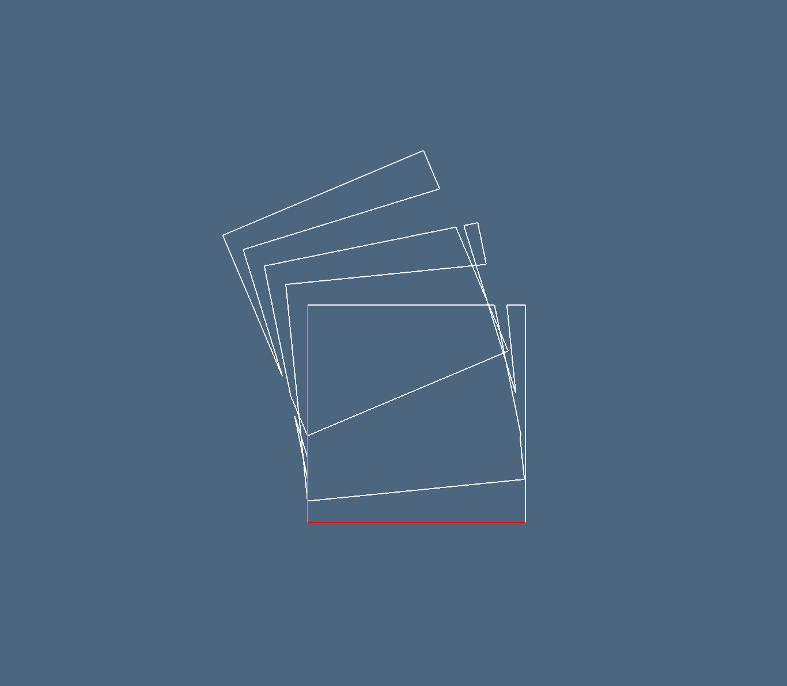
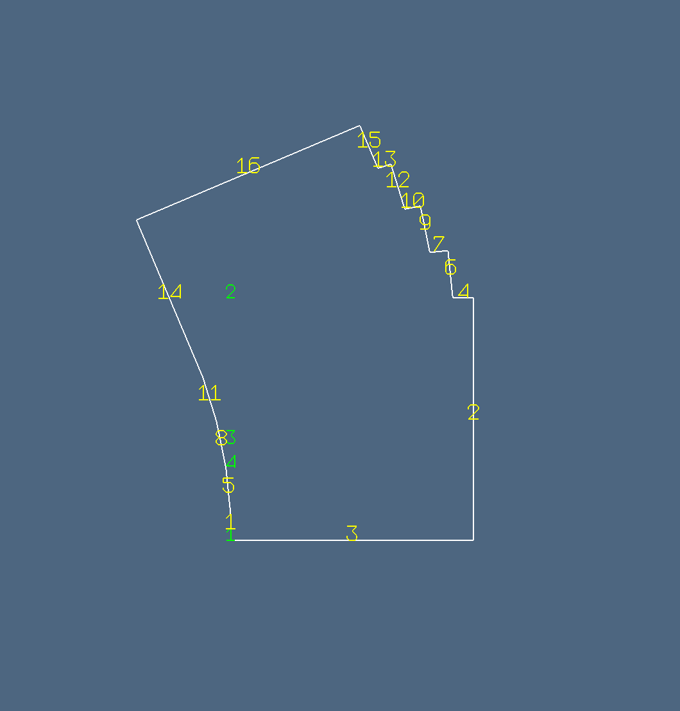
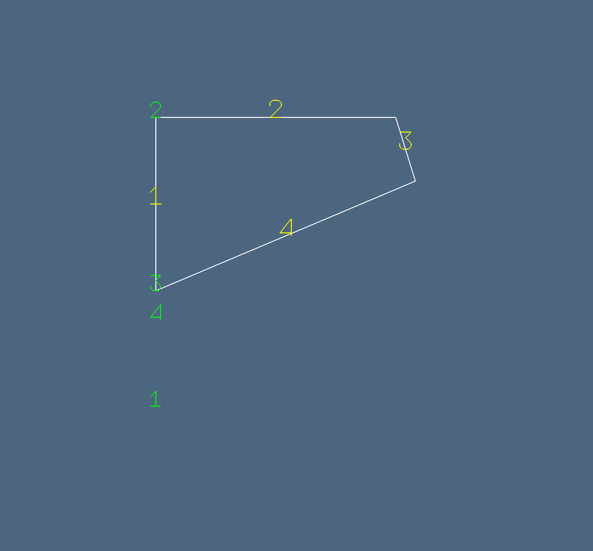
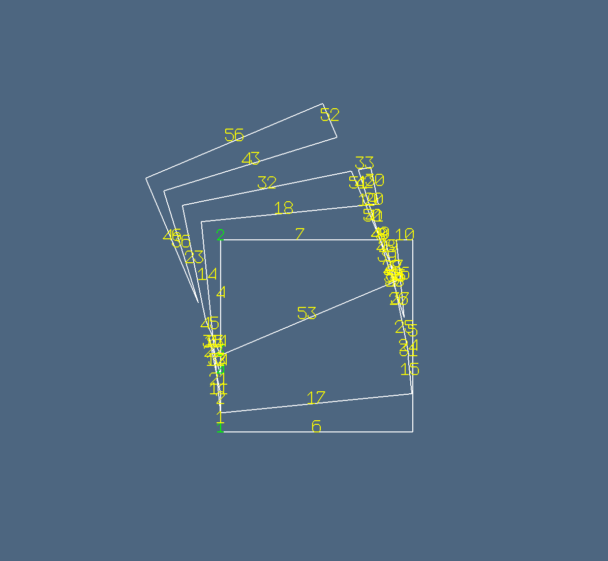

## Esempio `bool2d`
```julia
using ViewerGL, SparseArrays, BenchmarkTools
import LinearAlgebraicRepresentation as Lar
GL = ViewerGL

V, (VV, EV, FV) = Lar.cuboidGrid([1, 1], true)
square = V, EV

assembly = Lar.Struct([
    Lar.Struct([Lar.t(0,0), Lar.r(0), square])
    Lar.Struct([Lar.t(0,0.1), Lar.r(0.1), square])
    Lar.Struct([Lar.t(0,0.2), Lar.r(0.2), square])
    Lar.Struct([Lar.t(0,0.3), Lar.r(0.3), square])
    Lar.Struct([Lar.t(0,0.4), Lar.r(0.4), square])
])

V, EV = Lar.struct2lar(assembly)
GL.VIEW([GL.GLGrid(V, EV, GL.COLORS[1], 1), GL.GLFrame2]);

W, copEV, copFE, boolmatrix = bool2d(assembly)

A = boolmatrix[:, 1]
B = boolmatrix[:, 2]
C = boolmatrix[:, 3]
D = boolmatrix[:, 4]
E = boolmatrix[:, 5]

AorB = A .| B .| C .| D .| E
AandB = A .& B .& C .& D .& E
AxorB = A .⊻ B .⊻ C .⊻ D .⊻ E

union = Matrix(copFE)' * Int.(AorB)
intersection = Matrix(copFE)' * Int.(AandB)
xor = Matrix(copFE)' * AxorB

V = convert(Lar.Points,W')
EV = Lar.cop2lar(copEV)
EVor = [ev for (k,ev) in enumerate(EV) if abs(union[k])==1 ]
EVand = [ev for (k,ev) in enumerate(EV) if abs(intersection[k])==1 ]
EVxor = [ev for (k,ev) in enumerate(EV) if abs(xor[k])==1 ]

GL.VIEW([ GL.GLGrid(V,EVor, GL.COLORS[1],1), GL.GLFrame2 ]);
GL.VIEW([ GL.GLGrid(V,EVand, GL.COLORS[1],1), GL.GLFrame2 ]);
GL.VIEW([ GL.GLGrid(V,EVxor, GL.COLORS[1],1), GL.GLFrame2 ]);

model = (V,[VV, EVor])
GL.VIEW( GL.numbering(.5)( model,GL.COLORS[1],0.1 ) );

model = (V,[VV, EVand])
GL.VIEW( GL.numbering(.5)( model,GL.COLORS[1],0.1 ) );

model = (V,[VV, EVxor])
GL.VIEW( GL.numbering(.5)( model,GL.COLORS[1],0.1 ) );
```
## Immagini `bool2d`







