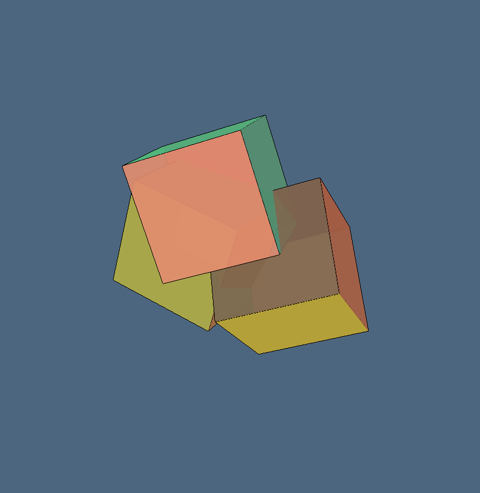
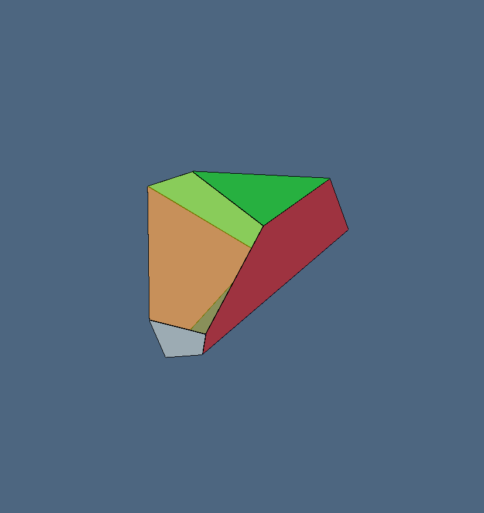
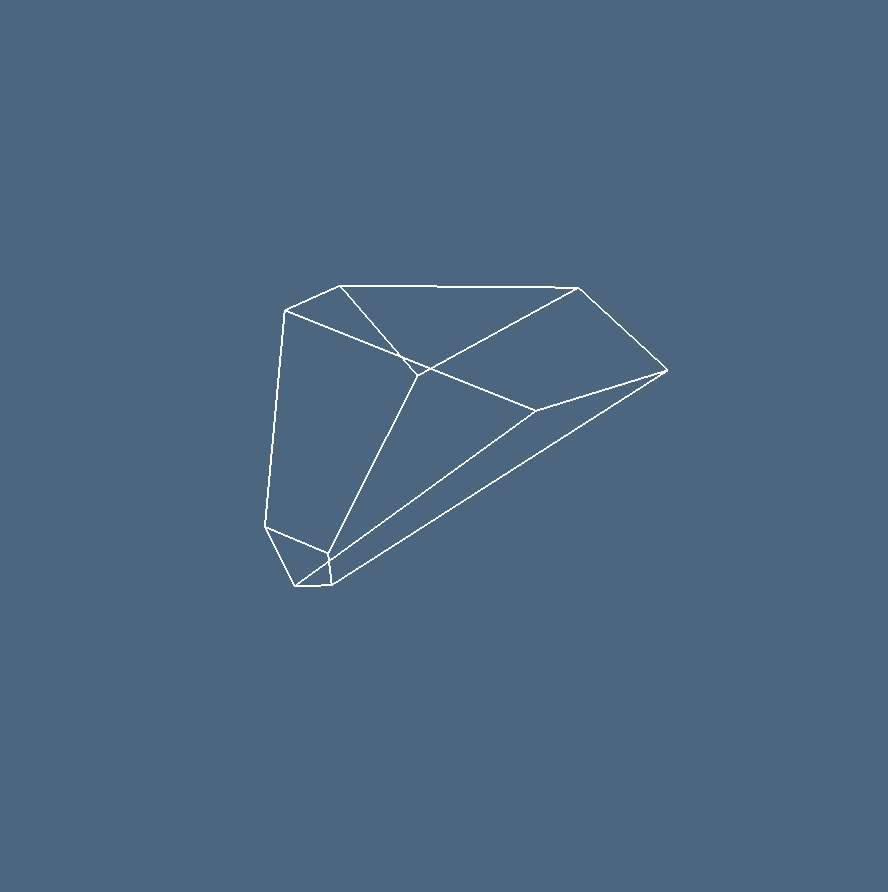
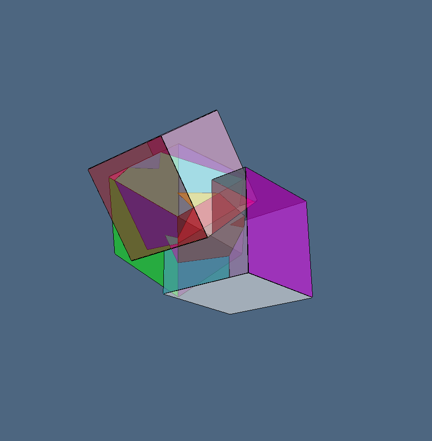
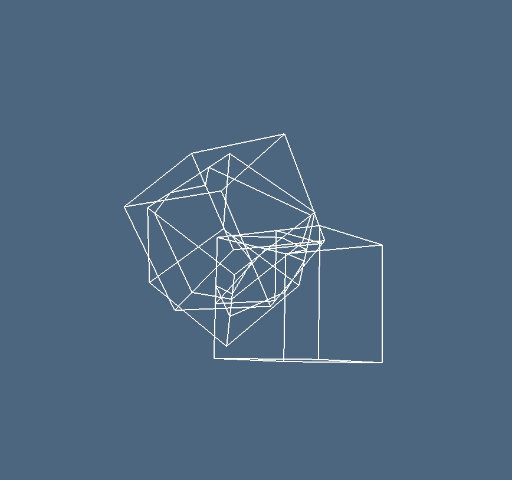
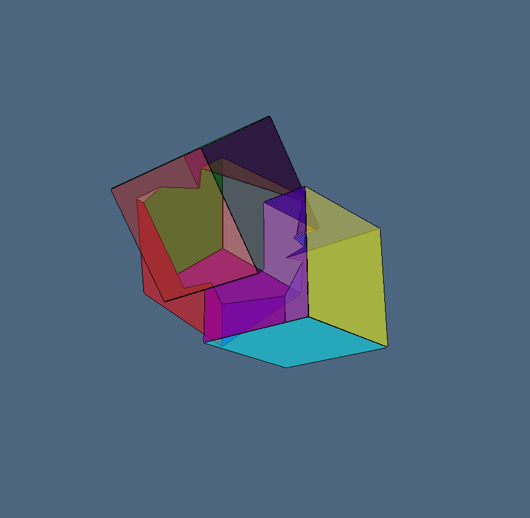
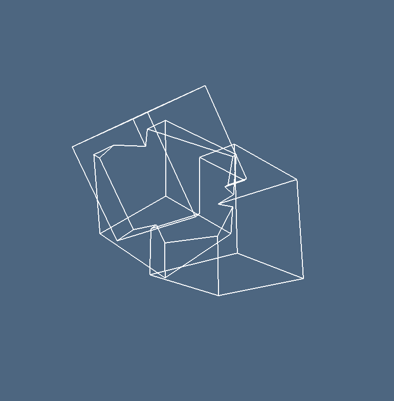
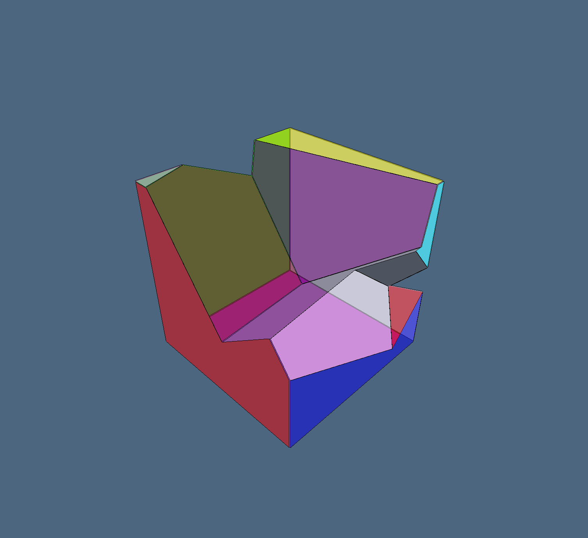
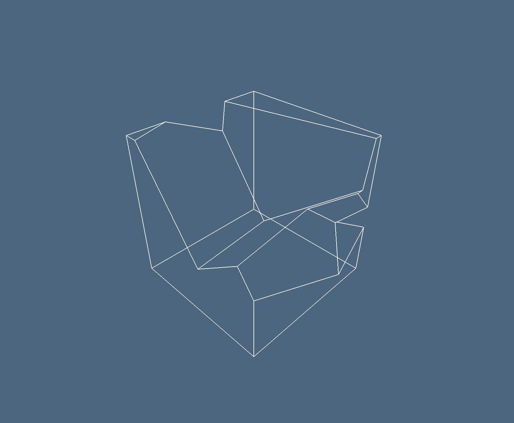

## Esempio `bool3d`
```julia
using SparseArrays, Base.Threads
import ViewerGL as GL
import LinearAlgebraicRepresentation as Lar

n, m, p = 1, 1, 1
V, (VV, EV, FV, CV) = Lar.cuboidGrid([n, m, p], true)
cube = V, FV, EV

assembly = Lar.Struct([ cube,
    Lar.t(.3,.4,.25), Lar.r(pi/5,0,0), Lar.r(0,0,pi/12), cube,
    Lar.t(-.2,.4,-.2), Lar.r(0,pi/5,0), Lar.r(0,pi/12,0), cube
])

V, FV = Lar.struct2lar(assembly)

meshes = []
for k = 1:length(FV)
    color = GL.MayaColors[k%12+1] - (rand(Float64, 4) * 0.1)
    push!(meshes, GL.GLGrid(V, [FV[k]], color, 0.9))
end
GL.VIEW(meshes);

W, copEV, copFE, copCF, boolmatrix = bool3d(assembly)
Matrix(boolmatrix)

A = boolmatrix[:, 2]
B = boolmatrix[:, 3]
C = boolmatrix[:, 4]

AorBorC = A .| B .| C
AandBandC = A .& B .& C
AxorBxorC = A .⊻ B .⊻ C
AminBminC = .&(A, .!B, .!C)

difference = Matrix(copCF)' * Int.(AandBandC)
xor = Matrix(copCF)' * Int.(AxorBxorC)
or = Matrix(copCF)' * Int.(AorBorC)
min = Matrix(copCF)' * Int.(AminBminC)

V, CVs, FVs, EVs = Lar.pols2tria(W, copEV, copFE, copCF, difference) 
GL.VIEW(GL.GLExplode(V, FVs, 1.01, 1.01, 1.01, 99, 0.5));
GL.VIEW(GL.GLExplode(V, EVs, 1, 1, 1, 1, 1));

V, CVs, FVs, EVs = Lar.pols2tria(W, copEV, copFE, copCF, xor)
GL.VIEW(GL.GLExplode(V, FVs, 1.01, 1.01, 1.01, 99, 0.5));
GL.VIEW(GL.GLExplode(V, EVs, 1, 1, 1, 1, 1));

V, CVs, FVs, EVs = Lar.pols2tria(W, copEV, copFE, copCF, or)
GL.VIEW(GL.GLExplode(V, FVs, 1.01, 1.01, 1.01, 99, 0.5));
GL.VIEW(GL.GLExplode(V, EVs, 1, 1, 1, 1, 1));


V, CVs, FVs, EVs = Lar.pols2tria(W, copEV, copFE, copCF, min)
GL.VIEW(GL.GLExplode(V, FVs, 1.01, 1.01, 1.01, 99, 0.5));
GL.VIEW(GL.GLExplode(V, EVs, 1, 1, 1, 1, 1));
```

## Immagini `bool3d`










