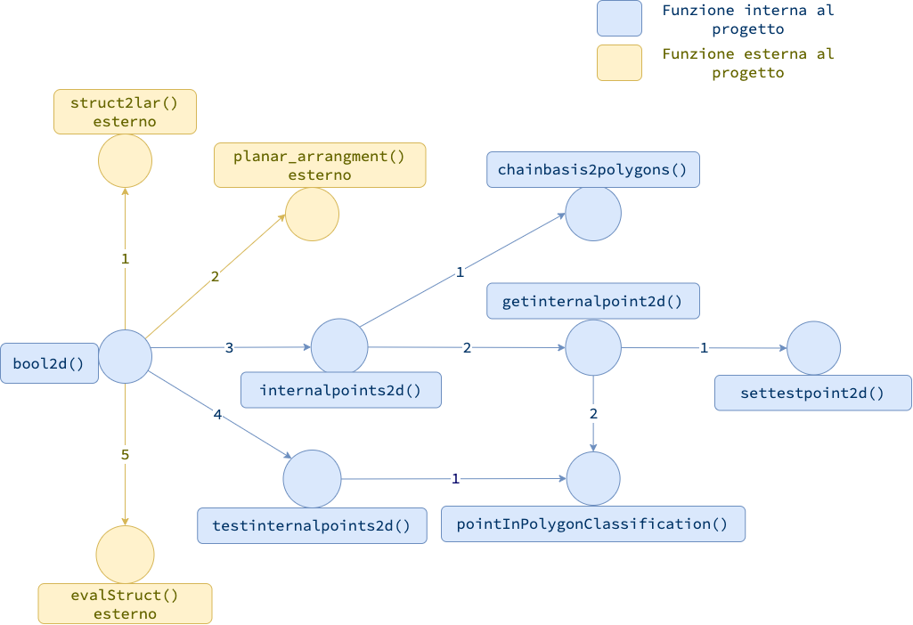
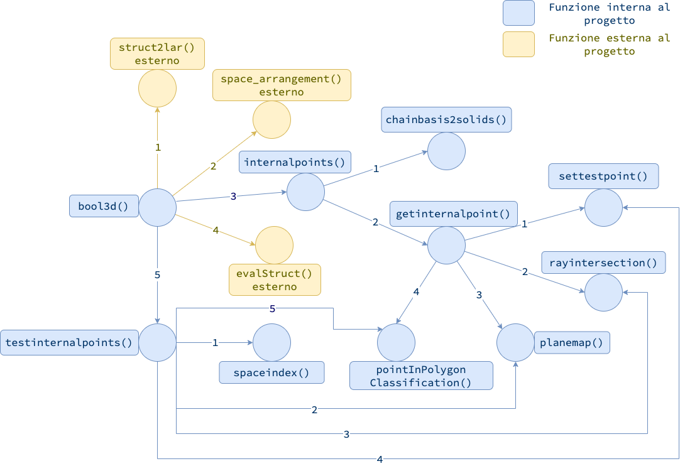

## Grafo delle dipendenze originale

In questa sezione è rappresentato il grafo orientato delle dipendenze della base di codice oggetto di studio.
Ogni arco orientato rappresenta una chiamata di funzione $(v_1, v_2)$, dove $v_1$ è la funzione chiamante, e $v_2$ è la funzione chiamata. I nodi hanno un’etichetta corrispondente al nome della funzione. Gli archi invece hanno una etichetta numerica consecutiva corrispondente all’ordine delle chiamate dal nodo loro origine.
Come mostrato nella figura, la funzione `pointInPolygonClassification()`, seppur non sia dichiarata direttamente all’interno dei file assegnati al progetto, è usata intensivamente e può essere presa in considerazione per possibili ottimizzazioni.

#### Grafo per bool2d

#### Grafo per bool3d

## Grafo delle dipendenze definitivo

Per quanto riguarda il grafo delle dipendenze relativamente allo studio definitivo, le dipendenze per Lar Generators (3D) non sono cambiate. È invece diverso il grafo di Lar Generators (2D), perché si è notato che la funzione `chainbasis2polygons()` non fosse più necessaria.

